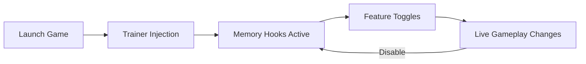

## Left 4 Dead 2 Trainer — Total Control in the Midst of Chaos

There is a certain poetry in apocalypse: the echo of gunfire, the rhythm of survival, the fragile silence between hordes. **Left 4 Dead 2** has always been about movement, instinct, and teamwork.
This **Left 4 Dead 2 Trainer** is not just a tool — it is a conductor’s baton, letting you reshape difficulty, pacing, and power with a single keystroke.

Whether you roam solo through infected streets or carve paths with friends, this software grants precision, freedom, and experimentation far beyond vanilla gameplay.

---

## ⚙️ Overview — What This Trainer Unlocks

The trainer is a lightweight Windows-based runtime utility designed to modify live gameplay values safely and instantly. It works by injecting controlled memory hooks, allowing toggles and sliders without touching core game files.

**Key philosophy:**
Control without chaos. Power without breaking immersion.

You decide when the world bends.

---

## 🎯 Core Features — Precision Over Panic

* **Infinite Health & Stamina** – Walk through hordes untouched, or fine-tune survivability for testing builds.
* **Unlimited Ammo / No Reload** – Keep the rhythm flowing when the infected won’t stop coming.
* **One-Hit Kill Toggle** – Perfect for cinematic runs, speed clears, or stress-free exploration.
* **God Mode for Team or Solo** – Apply selectively to player, AI teammates, or everyone.
* **Freeze Special Infected** – Study enemy behavior like a tactician, not prey.
* **Spawn Control** – Trigger hordes or bosses manually for practice scenarios.
* **Speed Modifier** – Slow time to savor tension or accelerate chaos into pure adrenaline ⚡

Each function can be enabled or disabled on the fly — no restarts, no reloads.

---

## 🚀 Setup Guide — From Silence to Control

Getting started is as simple as loading a shotgun.

1. Launch **Left 4 Dead 2** normally via Steam
2. Start a campaign or load into a safe room
3. Run the **Trainer executable** as Administrator
4. Wait for confirmation: *“Game detected”*
5. Use hotkeys or the UI panel to toggle features live

Example hotkey layout (customizable):

```text
F1  - God Mode
F2  - Infinite Ammo
F3  - One-Hit Kill
F4  - Speed Boost
NUM0 - Disable All
```

No configuration files required — but advanced users can bind profiles per campaign.

---

## 🧠 How the Trainer Works (Conceptual Flow)



Clean, reversible, and designed to leave no residue once closed.

---

## 🧪 Use Cases — More Than Just Power

This trainer is not only about dominance. Many players use it creatively:

* 🎥 **Cinematic Machinima Recording**
* 🧭 **Map Exploration Without Pressure**
* 🧑‍🏫 **Teaching New Players Mechanics**
* ⚙️ **Weapon & Enemy Testing**
* 🧘 **Relaxed Story Runs**

Sometimes survival isn’t about fear — it’s about curiosity.

---

## ❓ FAQ — Whispered Questions, Clear Answers

**Is this a mod or a cheat?**
It’s a runtime trainer. No game files are altered.

**Will it break achievements?**
Achievements may unlock normally offline, but results can vary depending on enabled features.

**Can I customize values (speed, damage)?**
Yes. Sliders allow fine control rather than binary on/off.

**Is it safe for my system?**
The trainer operates locally and does not install background services.

**Does it work with mods?**
Generally yes, though heavy gameplay mods may conflict with certain memory values.

---

## 🛑 A Note on Responsibility

> [!WARNING]
> Power is tempting. Use it thoughtfully. Trainers are tools — not excuses to disrupt others’ experiences.

Private sessions, personal experiments, and creative play are where this software shines brightest.

---

## 🌑 Final Thoughts — When the Horde Pauses

There is beauty in mastery.
With the **Left 4 Dead 2 Trainer**, panic becomes choice, and chaos becomes choreography. You decide how hard the night is, how fast the blood flows, and when the silence returns.

Take control. Bend the apocalypse.
And walk forward — unafraid.

---
